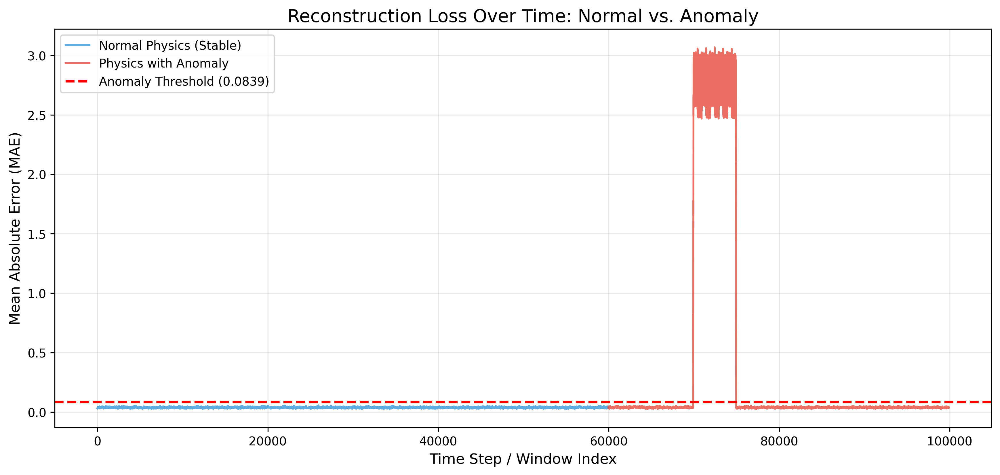

# 🚀 Genesis Oracle: Physics-Informed Anomaly Detection

Welcome to the Genesis Oracle project. This repository explores the use of Agentic Engineering and Convolutional Autoencoders to detect anomalies in physical signal flows.

## 📊 Experiment Summary
In this experiment, we upgraded a standard Dense Autoencoder to a **Conv1D-based architecture** to better capture the temporal dependencies and non-stationary nature of physical signals. The model was trained on "normal" physics data (square wave with RC filter and noise) and tested against a dataset containing an injected anomaly.

### Key Results:
- **Architecture**: Conv1D Encoder/Decoder for local pattern recognition.
- **Error Metric**: Mean Absolute Error (MAE).
- **Detection**: The model successfully identifies the anomaly with a significant spike in the reconstruction loss.

## 🚨 Anomaly Detection Result
Below is the reconstruction error (MAE) over time. The red dashed line represents the automated anomaly threshold.

---
*Developed by Benjamin Gielczynski as part of the AMS module.*
